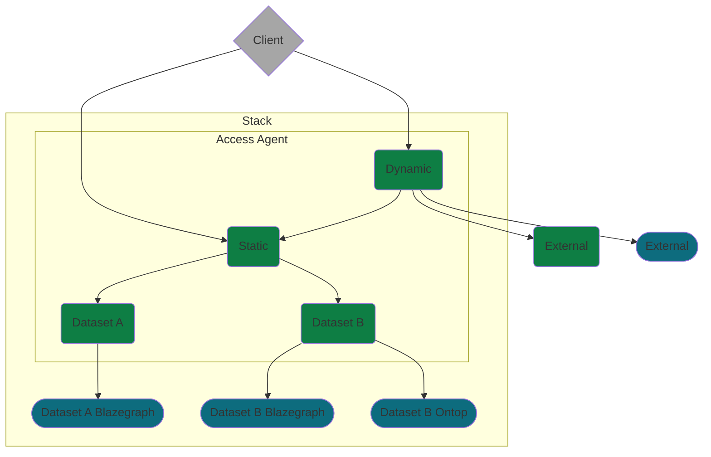
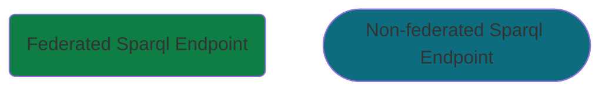

# Access Agent

The Access Agent allows for SPARQL federation across a endpoints within a [TWA Stack](https://github.com/TheWorldAvatar/stack) as well as external endpoints.

## Dataset endpoint

A dataset endpoint federates across each endpoint related to a dataset in a stack.
When a new dataset is added to this stack a new federated endpoint will be added.

## Static stack endpoint

A static stack endpoint federates across each [dataset endpoint](#dataset-endpoint) in a stack.
When a new dataset is added to this stack its dataset endpoint will be included in this federation.

## Dynamic stack endpoint

A dynamic stack endpoint creates a federation at query time across internal and external endpoints.
In future, the endpoints will be chose based on the query.
In the first implementation the [static stack endpoint](#static-stack-endpoint) along with a specified list of external endpoints will be used.

## Design

The diagram below illustrates how each of the federated endpoints are related to each other.

With the following key

