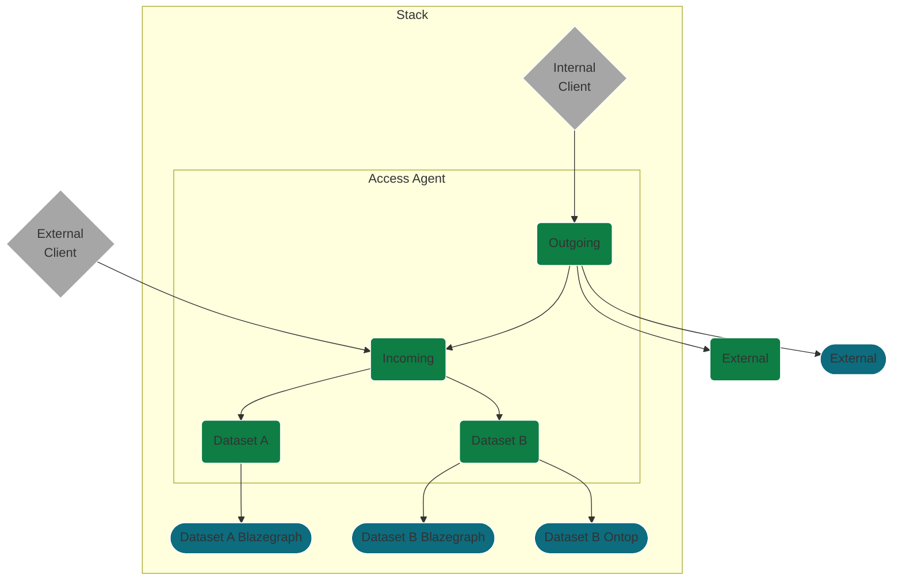

# Access Agent

The Access Agent allows for SPARQL federation across a endpoints within a [TWA Stack](https://github.com/TheWorldAvatar/stack) as well as external endpoints.

## Endpoints

### Dataset endpoint

A dataset endpoint is an endpoint that federates across each endpoint related to a dataset in a stack.
When a new dataset is added to this stack a new federated dataset endpoint will be added.
This endpoint will persist for multiple queries and it will therefore be referred to as "static".

### Incoming stack endpoint

An incoming stack endpoint federates across each [dataset endpoint](#dataset-endpoint) in a stack.
This endpoint will be used by external clients querying data in this stack.
When a new dataset is added to this stack its dataset endpoint will be added to this federation.
This endpoint will persist for multiple queries and it will therefore be referred to as "static".

### Outgoing stack endpoint

An outgoing stack endpoint is a federation between internal and external endpoints.
This endpoint will be used by agents internal to this stack, accessing internal and external data.
It is not used by external clients in case loops are caused with other Access Agents.

The challenge of querying from external endpoints is that there are potentially very many of these endpoints and they could have performance difficulties.
There are two potential implementations to address this question in different ways.

#### Dynamic implementation

In this implementation a federation is created at query time ("dynamic").
The endpoints that make up this federation are chosen based on the query and an indexed set of potential endpoints.

A first implementation could just federated across the [incoming stack endpoint](#incoming-stack-endpoint) and a specified list of external endpoints.
In future, new external endpoints could be register and indexing would be used to select the federation.

#### Static implementation

In this implementation an endpoint is created when the Access Agent starts up ("static").
The [service description](https://www.w3.org/TR/sparql11-service-description/) for each external service is cached locally.
If the service description is not available for that endpoint a construct query would be used to make it.
All `ASK` queries from the federation would be answered using some middleware and the service description.
Then, full advantage could be taken of native indexing of the federated endpoint.

## Design

The diagram below illustrates how each of the federated endpoints are related to each other.

With the following key

