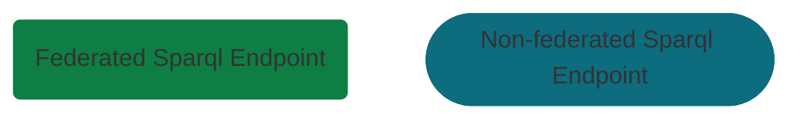

# Access Agent

The Access Agent allows for SPARQL federation across a endpoints within a [TWA Stack](https://github.com/TheWorldAvatar/stack) as well as external endpoints.

## Dataset endpoint

A dataset endpoint is an endpoint that federates across each endpoint related to a dataset in a stack.
When a new dataset is added to this stack a new federated endpoint will be added.
This endpoint will persist for multiple queries and it will therefore be referred to as "static".

## Incoming stack endpoint

An incoming stack endpoint federates across each [dataset endpoint](#dataset-endpoint) in a stack.
This endpoint will be used by external clients querying data in this stack.
When a new dataset is added to this stack its dataset endpoint will be added to this federation.
This endpoint will persist for multiple queries and it will therefore be referred to as "static".

## Outgoing stack endpoint

A incoming stack endpoint creates a federation at query time across internal and external endpoints.
This endpoint will be used by agents internal to this stack, accessing internal and external data.
It is not used by external clients in case loops are caused with other Access Agents.
In future, the endpoints will be chose based on the query.
In the first implementation the [incoming stack endpoint](#incoming-stack-endpoint) along with a specified list of external endpoints will be used.

## Design

The diagram below illustrates how each of the federated endpoints are related to each other.

With the following key

